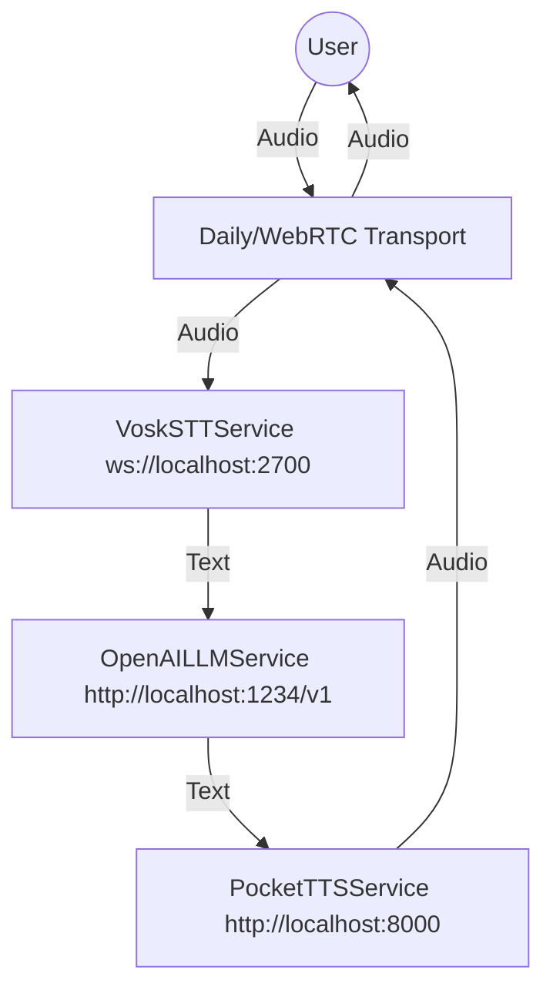

# Plan: Custom Pipecat Bot with Local Services

This plan outlines the steps to build a Pipecat bot using local services: Vosk (ASR), LMStudio (LLM), and Kyutai Pocket TTS (TTS).

## Architecture Overview

The bot will follow the Pipecat pipeline architecture, replacing the default cloud services with local alternatives.

- **ASR (STT):** Vosk Server (WebSocket) at `ws://localhost:2700`
- **LLM:** Liquid LFM 2.5-1.2B via LMStudio (OpenAI-compatible API) at `http://localhost:1234/v1`
- **TTS:** Kyutai Pocket TTS (HTTP) at `http://localhost:8000` (assumed default port for `pocket-tts serve`)

## Components to Implement

### 1. VoskSTTService
- **Base Class:** `WebsocketService` and `STTService`
- **Protocol:** WebSocket
- **Input:** Audio chunks (PCM)
- **Output:** `TranscriptionFrame` or `InterimTranscriptionFrame`
- **Location:** `src/pipecat/services/vosk/stt.py`

### 2. PocketTTSService
- **Base Class:** `TTSService`
- **Protocol:** HTTP (POST)
- **Input:** Text
- **Output:** Audio frames (PCM)
- **Location:** `src/pipecat/services/kyutai/tts.py`

### 3. Bot Script
- **Base:** `examples/quickstart/bot.py`
- **Modifications:**
    - Use `VoskSTTService` instead of `DeepgramSTTService`.
    - Use `OpenAILLMService` with `base_url="http://localhost:1234/v1"` and `model="liquid/lfm2.5-1.2b"`.
    - Use `PocketTTSService` instead of `CartesiaTTSService`.
- **Location:** `examples/custom_bot.py`

## Implementation Steps

1.  **Implement `VoskSTTService`**: Create a new service that connects to the Vosk WebSocket server.
2.  **Implement `PocketTTSService`**: Create a new service that interacts with the Pocket TTS HTTP server.
3.  **Create `examples/custom_bot.py`**: Assemble the pipeline using the new services and LMStudio.
4.  **Testing**: Verify each component individually if possible, then the full pipeline.

## Mermaid Diagram

